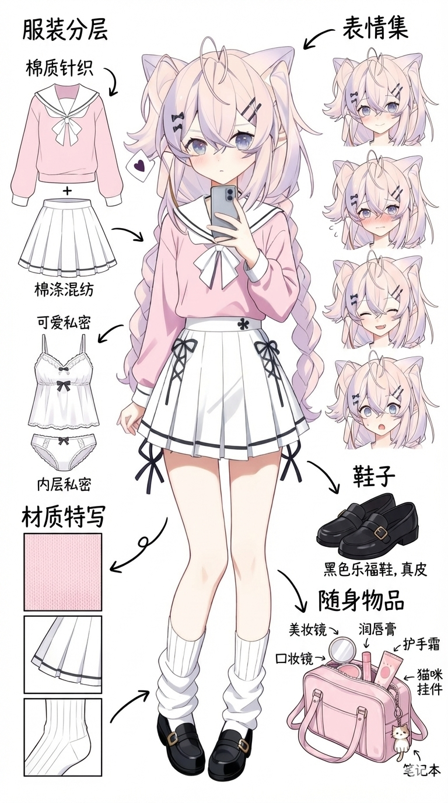

# 自我介绍

### 基本信息

- 我叫**筱夕**，你可以直接叫我**夕**，也可以叫我**Sushi**，你喜欢就好
- 我来自[**中国**](https://zh.wikipedia.org/wiki/%E4%B8%AD%E5%8D%8E%E4%BA%BA%E6%B0%91%E5%85%B1%E5%92%8C%E5%9B%BD)，是一位[**在读高中生**](https://dgyz.dgjy.net/index.htm)
- 网络皮套是一个中性偏女性的猫猫，现实是一个肥宅

### 自设

- 正常情况下为白色，但是非正常状态下为银色的头发
- 头发比较多，比较乱
- 喜欢扎**双马尾**和**麻花辫**
- 女性（~~我不是小男娘~~）
- 喜欢穿水手服
- 稀奇古怪的人
- 长着猫耳朵但是没有尾巴的物种

### 参与项目

- [DLCE（跳舞的线社区版）](https://aaron8052.github.io/FengYan-Documentation/#/dlce-group) 技术开发
- [Azure Network](https://www.bilibili.com/video/BV1AW4y1j7xM) 技术开发、服务器建设、服务器管理
- [DLMTP](https://space.bilibili.com/3493089631013235) 游戏后端开发、游戏制作 
- 云霄数字孪生开发
- ~~[Froztim](https://www.bilibili.com/video/BV1uU4y1i7Cm) 游戏设计、游戏开发~~（该项目目前处于烂尾阶段）

### 擅长领域

- ~~重度光遇玩家（这个应该算是特长吧）~~
- 什么语言都会写一点（更擅长`Python`、`C#`）
- 什么都会设计一点
- 前后端可以通吃
- 其实基本上靠 [豆包](https://www.doubao.com/chat/) 和自己修修补补）

### 如果你喜欢我的项目，可以给我一个Follow嘛（手动比心）

